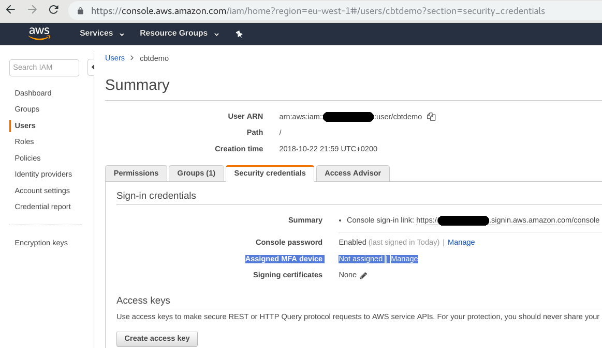
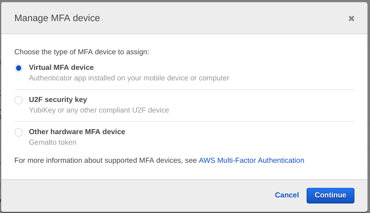
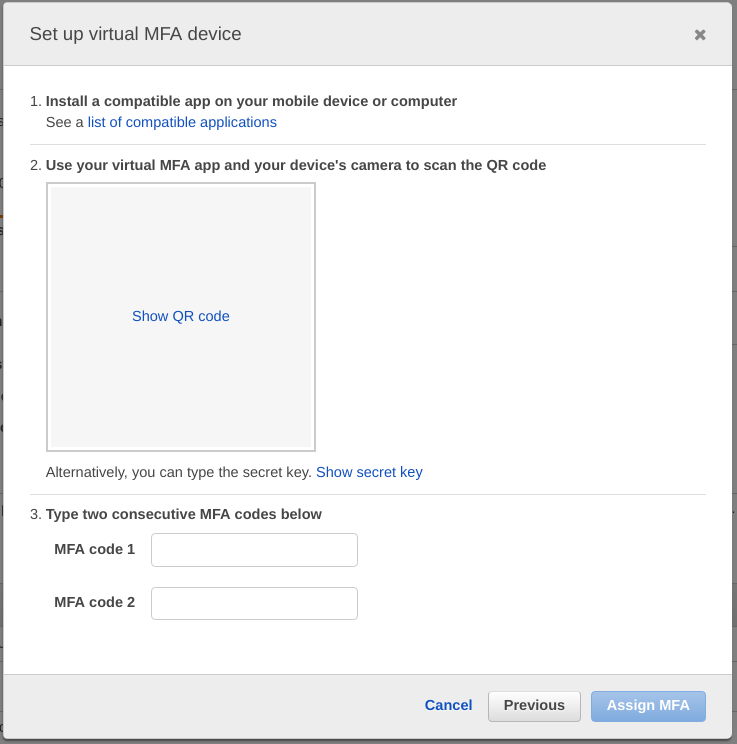

# Setup 2FA/MFA for your AWS account
Setup Two Factor Authentication / Multi Factor Authentication for your AWS account.

First, install a mobile app on your mobile phone. e.g. Google Authenticator

Then, in your AWS console, login as the user you want to setup 2FA/MFA for. From the main interface, go to IAM->Users->Security credentials. Use the following screens as example to setup MFA using your mobile phone.

