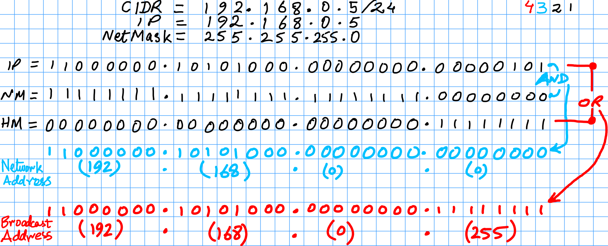
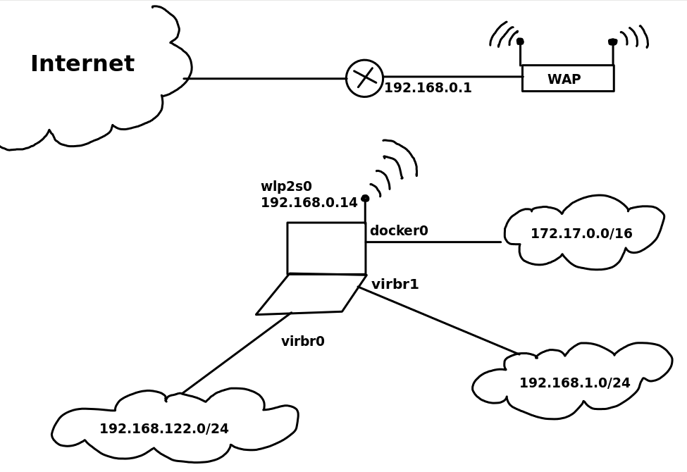
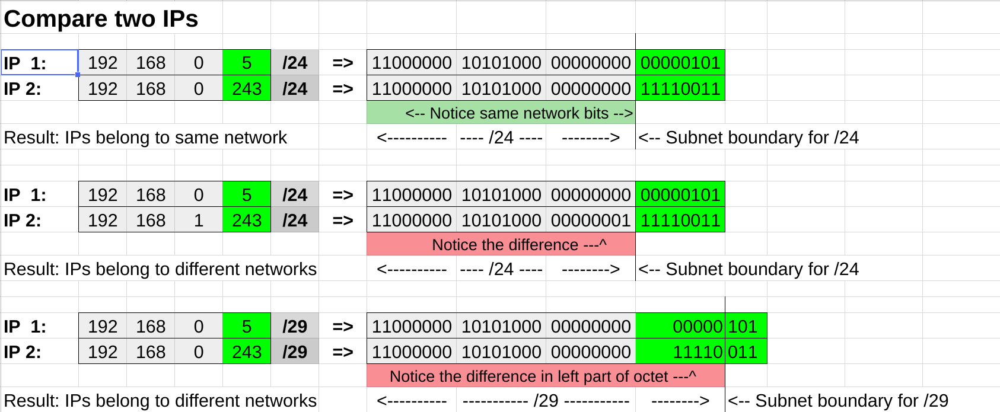

# Subnetting!

## Topics:
### What is the purpose of a network mask?
* Help the computer figure out if two IPs belong to the same network, or different network; and what to do in either case
* Helps in calculating network and broadcast addresses of a given IP address
* Based on network and broadcast address, we can calculate total number of IPs, total number of subnets and subnet addresses corresponding to a given IP address

|  |
:-------------------------:
| Binary calculation of Network and Broadcast addresses |

|  |
:-----------------------------------------:
| Example network setup involving multiple networks |

|  |
:-------------------:
| Binary comparison of two IPs using network mask's bit boundaries |

### What is CIDR?, and, why subnet a network?
* The default *classful* networks are sometimes too large or too small for a network setup. CIDR helps slow the rapid exhaustion of IPv4 addresses.
* Subnets allow efficient use of IP addresses provided by network administrator or upstream vendor
* On the larger scale, it means, that it slows down the growth of routing tables on routers across the Internet
* Subnets reduces the size of collision domain - used to be true for "hubs"
* Subnets reduces the size of broadcast domain
* Subnets isolates certain type of traffic from certain other type of network traffic by breaking the network down in smaller sections
* A routing device is required to let traffic-flow between various subnets and other networks

### What is subnet sizing?
* How many sub networks are possible in a *subnetted* network?
* How many hosts are possible in each network?

### Given an IP address and a subnet mask, what is the corresponding: 
* Network Address? 
* Broadcast Address? 
* Total number of hosts?
* Host Range? 
* Total subnets?
* Subnet addresses?

## Helpful files:
* [The online/Google spreadsheet used in the CBT](https://docs.google.com/spreadsheets/d/15EKKwzCn5uEutmqAf4rFJT0lrrbNxCzd8HHM_YSuczc/edit?usp=sharing)
* [Network-Subnetting_Binary-Method.xlsx](Network-Subnetting_Binary-Method.xlsx)
* [Network-Subnetting_Binary-Method.ods](Network-Subnetting_Binary-Method.ods)
* Free-hand sheet [subnetting.xoj](subnetting.xoj) (Use Xournal on Linux to open this file)

## Helpful online resources:
* My videos/lectures in Urdu language, about these topics:
  * [https://www.youtube.com/watch?v=pH--Mgwttcc](https://www.youtube.com/watch?v=pH--Mgwttcc)
  * [https://www.youtube.com/watch?v=nBvHNAw341c](https://www.youtube.com/watch?v=nBvHNAw341c)
  * [https://www.youtube.com/watch?v=TEwrbjQABDc](https://www.youtube.com/watch?v=TEwrbjQABDc)
  * [https://www.youtube.com/watch?v=m09NycTZPiY](https://www.youtube.com/watch?v=m09NycTZPiY)
* [https://en.wikipedia.org/wiki/Classless_Inter-Domain_Routing](https://en.wikipedia.org/wiki/Classless_Inter-Domain_Routing)
* [https://learningnetwork.cisco.com/blogs/vip-perspectives/2014/05/15/network-binary-math-explained](https://learningnetwork.cisco.com/blogs/vip-perspectives/2014/05/15/network-binary-math-explained)
* [https://networkengineering.stackexchange.com/questions/7106/how-do-you-calculate-the-prefix-network-subnet-and-host-numbers](https://networkengineering.stackexchange.com/questions/7106/how-do-you-calculate-the-prefix-network-subnet-and-host-numbers)
* [http://www.ciscopress.com/articles/article.asp?p=174107&seqNum=3](http://www.ciscopress.com/articles/article.asp?p=174107&seqNum=3)
* [https://www.eventhelix.com/RealtimeMantra/Networking/ip_routing.htm#.XBArl3VKjHQ](https://www.eventhelix.com/RealtimeMantra/Networking/ip_routing.htm#.XBArl3VKjHQ)
* [https://www.pluralsight.com/blog/it-ops/simplify-routing-how-to-organize-your-network-into-smaller-subnets](https://www.pluralsight.com/blog/it-ops/simplify-routing-how-to-organize-your-network-into-smaller-subnets)
* [https://www.uhcl.edu/computing/information-security/tips-best-practices/routers](https://www.uhcl.edu/computing/information-security/tips-best-practices/routers)
* [https://www.uhcl.edu/computing/information-security/tips-best-practices/ipaddressing](https://www.uhcl.edu/computing/information-security/tips-best-practices/ipaddressing)

## Subnet calculators:
* [https://www.rapidtables.com/convert/number/decimal-to-binary.html](https://www.rapidtables.com/convert/number/decimal-to-binary.html)
* [http://cidr.xyz/](http://cidr.xyz/)
* [http://www.subnet-calculator.com/subnet.php](http://www.subnet-calculator.com/subnet.php)
* [https://www.calculator.net/ip-subnet-calculator.html](https://www.calculator.net/ip-subnet-calculator.html)
* ... and countless other websites providing binary-decimal/decimal-binary calculators 

