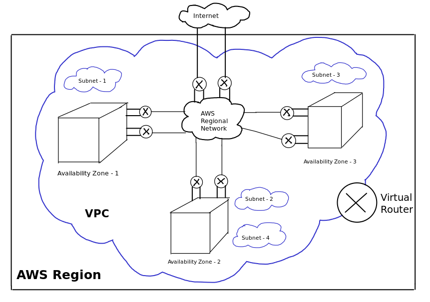
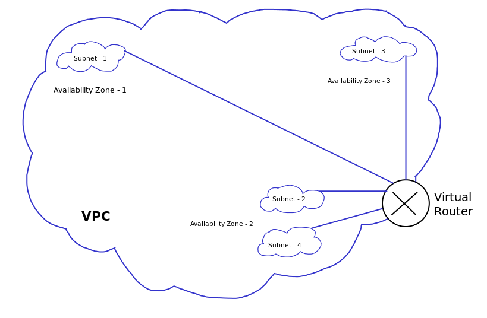

# Understanding AWS Virtual Private Cloud - VPC
## First off, what is it?
Well, in Amazon's own words, a virtual private cloud (VPC) is a virtual network dedicated to your AWS account. It is logically isolated from other virtual networks in the AWS Cloud, may those *other virtual networks* be in your account, or belong to some other AWS account/customer. You launch your AWS resources, such as Amazon EC2 instances, Amazon RDS instances into your VPC. You can specify an IP address range of your own choice for the VPC, add it's related subnets; associate security groups; configure network access control and configure route tables. You can also setup VPN connections to your VPC.

Think of VPC as your *virtual data center* - in the cloud. Whatever you can think of doing in a data center, you do almost the same in your VPC.


Reference documents:
* [https://docs.aws.amazon.com/vpc/latest/userguide/what-is-amazon-vpc.html](https://docs.aws.amazon.com/vpc/latest/userguide/what-is-amazon-vpc.html)
* [https://docs.aws.amazon.com/vpc/latest/adminguide/Introduction.html](https://docs.aws.amazon.com/vpc/latest/adminguide/Introduction.html)

## What is AWS VPC?
* A virtual data center in one region, spread over multiple AZ for resilience
* Every region in the world has a default VPC
* Ability to create public and private subnets out of the main VPC network
* Use security groups and ACLs to control access to resources in a VPC
* Connect corporate network to the VPC using VPN
* At any given time, one subnet is placed only in one AZ
* Security group can be considered a host firewall for each individual AWS EC2 or RDS instances, etc
* Security group can be used across multiple subnets, because it is not actually AZ dependent
* Usable IP ranges for a VPC are:
** 10.0.0.0/16
** 172.16.0.0/16
** 192.168.0.0/16
* Use some online tool to figure out how to slice your vpc network into subnets (http://cidr.xyz, https://www.calculator.net/ip-subnet-calculator.html)
* One VPC can have only one internet gateway (igw)
* For instances in private subnet, NAT gateway or NAT (ec2) instances can be used to connect to the internet
* Instances on private subnet can be accessed using a jump-box , or a bastion host
* There can be max 5 vpcs in one aws account
* IGW are provided by AWS and are always in HA mode, spanning multiple AZ
* Multiple VPCs can be peered together using VPC peering.


## VPC look and feel
These are free-hand drawings - not very polished. This will be improved later.





## Hands on

* Create VPC , public and private subnets
* Create EC2 instances in both subnets
* Create a new SSH key for instance while creating the first EC2 instance
* Access the ec2 instances over SSH

```
ssh-add -l
ssh-add -k key-name

ssh -A -i key-name ec2-user@public-instance

ssh ec2-user@private-instance
```


